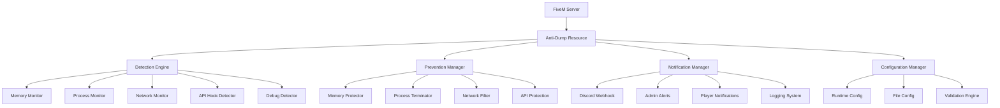
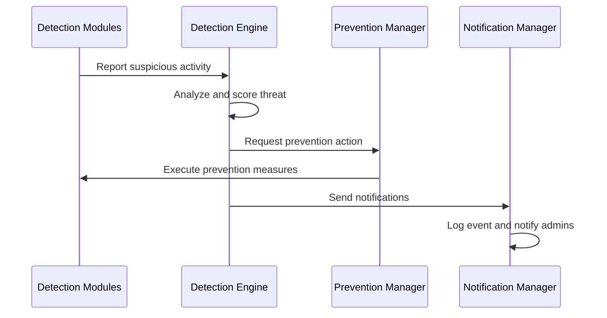
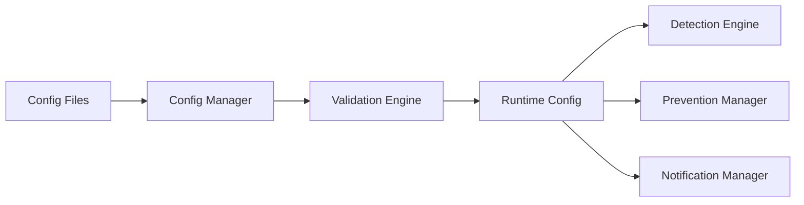

# FiveM Anti-Dump System - Architecture Documentation

## System Overview

The Anti-Dump System is a comprehensive security solution designed to detect, prevent, and respond to server dumping attempts in FiveM environments. The system employs multiple layers of protection to identify and neutralize various dumping techniques while maintaining minimal performance impact.

## Core Design Principles

- **Layered Security**: Multi-layered approach combining detection, prevention, and response
- **Minimal Performance Impact**: Optimized for low CPU and memory usage
- **Modular Design**: Components can be enabled/disabled independently
- **Framework Agnostic**: Compatible with popular FiveM frameworks
- **Configurable**: Extensive configuration options for customization
- **Scalable**: Designed to handle varying server loads

## System Architecture

### High-Level Component Diagram



## Component Responsibilities

### Detection Engine (`server/detection/engine.lua`)
- **Purpose**: Central coordinator for all detection mechanisms
- **Responsibilities**:
  - Orchestrates detection modules
  - Aggregates detection results
  - Implements detection scoring algorithms
  - Manages detection thresholds and sensitivity

### Memory Monitor (`server/detection/memory.lua`)
- **Purpose**: Detects memory-based dumping attempts
- **Detection Methods**:
  - Memory access pattern analysis
  - Page protection monitoring
  - Unusual memory allocation detection
  - Memory scanning signature detection

### Process Monitor (`server/detection/process.lua`)
- **Purpose**: Identifies dumping tools and processes
- **Detection Methods**:
  - Known dumper signature detection
  - Process behavior analysis
  - Parent-child process relationship tracking
  - Module enumeration and injection detection

### Network Monitor (`server/detection/network.lua`)
- **Purpose**: Detects network-based dumping activities
- **Detection Methods**:
  - Packet pattern analysis
  - Unusual traffic pattern detection
  - Protocol deviation identification
  - Data exfiltration attempt detection

### Prevention Manager (`server/prevention/manager.lua`)
- **Purpose**: Coordinates all prevention and blocking mechanisms
- **Responsibilities**:
  - Activates appropriate prevention measures
  - Manages prevention intensity levels
  - Handles false positive mitigation
  - Coordinates with detection engine

## Detection Algorithms

### 1. Signature-Based Detection
```lua
-- Example signature detection algorithm
local function detectKnownDumpers()
    local runningProcesses = getRunningProcesses()
    local dumperSignatures = loadSignatures("lib/signatures.json")

    for _, process in ipairs(runningProcesses) do
        for _, signature in ipairs(dumperSignatures) do
            if compareSignature(process, signature) then
                return {
                    type = "KNOWN_DUMPER",
                    process = process,
                    signature = signature,
                    confidence = signature.confidence
                }
            end
        end
    end

    return nil
end
```

### 2. Behavioral Analysis
- Monitors process behavior patterns
- Tracks memory access frequency and patterns
- Analyzes system call patterns
- Detects unusual resource usage

### 3. Heuristic Detection
- Statistical analysis of system behavior
- Anomaly detection using machine learning techniques
- Threshold-based alerting for suspicious activities

## Prevention Mechanisms

### Memory Protection Strategies
1. **Dynamic Page Protection**: Modify memory page permissions at runtime
2. **Memory Encryption**: Encrypt sensitive memory regions
3. **Guard Pages**: Place guard pages around protected memory
4. **Memory Obfuscation**: Obfuscate memory structures

### Process Termination Protocol
```lua
local function terminateSuspiciousProcess(processInfo)
    if isWhitelisted(processInfo) then
        return false
    end

    -- Graceful termination attempt
    local success = terminateProcess(processInfo.pid)
    if success then
        logDetection("PROCESS_TERMINATED", processInfo)
        notifyAdmins("DUMPER_TERMINATED", processInfo)
        return true
    end

    -- Force termination if graceful fails
    return forceTerminateProcess(processInfo.pid)
end
```

## Data Flow Architecture

### Detection Flow


### Configuration Flow


## Security Considerations

### Tamper Resistance
- System components are protected against modification
- Configuration files are digitally signed
- Runtime integrity checking is implemented
- Critical functions are obfuscated

### Attack Vector Mitigation
1. **Rootkit Detection**: Advanced techniques to detect kernel-level rootkits
2. **DLL Injection Prevention**: Monitoring and prevention of malicious DLL injection
3. **Process Hollowing Detection**: Identification of process hollowing techniques
4. **API Hook Prevention**: Protection against API hooking attempts

### Secure Communication
- All inter-component communication is encrypted
- Network traffic is obfuscated to prevent analysis
- Database connections use secure protocols
- External API calls are authenticated

## Scalability Considerations

### Performance Optimization
- Asynchronous processing for non-critical operations
- Caching of frequently accessed data
- Efficient memory management and garbage collection
- Minimal system call overhead

### Horizontal Scaling Support
- Stateless design allows for multiple instances
- Database sharding for large-scale deployments
- Load balancing support for high-traffic scenarios
- Configuration synchronization across instances

### Resource Management
- CPU usage monitoring and throttling
- Memory usage optimization
- Network bandwidth management
- Disk I/O optimization for logging

## Configuration System

### Configuration Categories
1. **Detection Configuration** (`config/detection.json`)
   - Enable/disable detection modules
   - Sensitivity thresholds
   - Scan frequencies
   - Signature update settings

2. **Prevention Configuration** (`config/prevention.json`)
   - Auto-termination settings
   - Memory protection levels
   - Network filtering rules
   - Response delay settings

3. **Notification Configuration** (`config/notifications.json`)
   - Discord webhook settings
   - Admin notification preferences
   - Log level settings
   - Rate limiting for notifications

### Hot Configuration Reload
```lua
-- Example hot reload mechanism
local function reloadConfiguration()
    local newConfig = loadConfigurationFiles()
    local validationResult = validateConfiguration(newConfig)

    if validationResult.valid then
        applyNewConfiguration(newConfig)
        notifyAdmins("CONFIGURATION_RELOADED")
        return true
    else
        logError("CONFIGURATION_RELOAD_FAILED", validationResult.errors)
        return false
    end
end
```

## Integration Points

### FiveM Framework Integration
- **Resource System**: Integrates as standard FiveM resource
- **Export System**: Provides exports for other resources
- **Event System**: Listens to and emits FiveM events
- **Server Functions**: Registers custom server functions

### External System Integration
- **Database Integration**: MySQL/PostgreSQL for log persistence
- **Discord Integration**: Webhook-based notifications
- **Admin Panel Integration**: REST API for web-based administration
- **Monitoring Integration**: Export metrics for monitoring systems

## Deployment Architecture

### Single Server Deployment
```
┌─────────────────────────────────────┐
│           FiveM Server              │
│  ┌─────────────────────────────────┐ │
│  │      Anti-Dump Resource         │ │
│  │  ┌─────────┬─────────┬─────────┐ │ │
│  │  │Detection│Prevention│Notification│ │
│  │  └─────────┴─────────┴─────────┘ │ │
│  └─────────────────────────────────┘ │
└─────────────────────────────────────┘
```

### Multi-Server Deployment with Load Balancer
```
┌─────────────────────────────────────┐
│         Load Balancer               │
├─────────────────────────────────────┤
│  ┌─────────────┐ ┌─────────────┐    │
│  │   FiveM     │ │   FiveM     │    │
│  │   Server 1  │ │   Server 2  │    │
│  │  Anti-Dump  │ │  Anti-Dump  │    │
│  └─────────────┘ └─────────────┘    │
└─────────────────────────────────────┘
          │              │
          └──────────────┼──────────────┘
                         │
                ┌──────────────┐
                │   Shared     │
                │  Database    │
                └──────────────┘
```

## File Structure

```
antidump/
├── client/                 # Client-side scripts (optional)
│   ├── main.lua           # Client entry point
│   ├── detection.lua      # Client-side detection
│   └── utils.lua          # Client utilities
├── server/                # Server-side scripts
│   ├── main.lua           # Server entry point
│   ├── config.lua         # Configuration manager
│   ├── detection/         # Detection modules
│   │   ├── engine.lua     # Main detection engine
│   │   ├── memory.lua     # Memory monitoring
│   │   ├── process.lua    # Process monitoring
│   │   ├── network.lua    # Network monitoring
│   │   ├── api_hooks.lua  # API hook detection
│   │   └── debugger.lua   # Debug detection
│   ├── prevention/        # Prevention modules
│   │   ├── manager.lua    # Prevention coordinator
│   │   ├── memory_protection.lua
│   │   ├── process_terminator.lua
│   │   ├── network_filter.lua
│   │   └── api_protection.lua
│   ├── notifications/     # Notification system
│   │   ├── manager.lua    # Notification coordinator
│   │   ├── discord.lua    # Discord integration
│   │   ├── logging.lua    # Logging system
│   │   └── alerts.lua     # Alert management
│   ├── integrations/      # External integrations
│   │   ├── database.lua   # Database connectivity
│   │   ├── frameworks.lua # Framework support
│   │   └── exports.lua    # Export functions
│   └── utils/             # Utility functions
│       ├── validation.lua # Input validation
│       ├── encryption.lua # Security utilities
│       └── performance.lua # Performance monitoring
├── config/                # Configuration files
│   ├── detection.json     # Detection settings
│   ├── prevention.json    # Prevention settings
│   ├── notifications.json # Notification settings
│   └── main.json         # Main configuration
├── docs/                  # Documentation
│   ├── API.md            # API documentation
│   ├── CONFIG.md         # Configuration guide
│   └── INTEGRATION.md    # Integration guide
├── lib/                   # Data files
│   ├── signatures.json   # Detection signatures
│   ├── patterns.json     # Detection patterns
│   └── whitelist.json    # Whitelist data
├── web/                   # Web interface (optional)
│   ├── admin.html        # Admin panel
│   ├── admin.js          # Admin interface
│   └── admin.css         # Admin styling
└── fxmanifest.lua        # FiveM manifest
```

## Key Benefits

1. **Comprehensive Protection**: Multi-layered approach against various dumping techniques
2. **Performance Optimized**: Minimal impact on server performance
3. **Highly Configurable**: Extensive customization options
4. **Framework Compatible**: Works with popular FiveM frameworks
5. **Scalable Design**: Supports servers of various sizes
6. **Active Development**: Modular design allows for easy updates
7. **Detailed Logging**: Comprehensive audit trail for security events
8. **Real-time Response**: Immediate action against detected threats

## Future Enhancements

1. **Machine Learning Integration**: Advanced anomaly detection using ML
2. **Cloud-based Analytics**: Centralized threat intelligence
3. **Advanced Obfuscation**: Enhanced protection against reverse engineering
4. **Distributed Detection**: Coordinated protection across multiple servers
5. **Threat Intelligence Sharing**: Community-based signature sharing
6. **Advanced Forensics**: Detailed analysis of attack attempts
7. **Automated Response**: AI-powered response to complex threats
8. **Blockchain Integration**: Immutable audit trails using blockchain

This architecture provides a solid foundation for a robust anti-dumping solution that can evolve with emerging threats while maintaining performance and compatibility with the FiveM ecosystem.